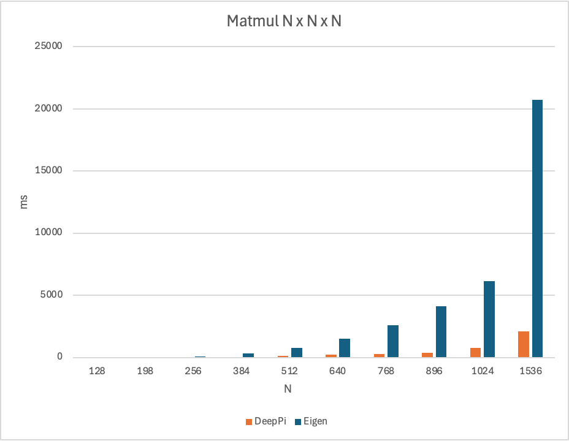
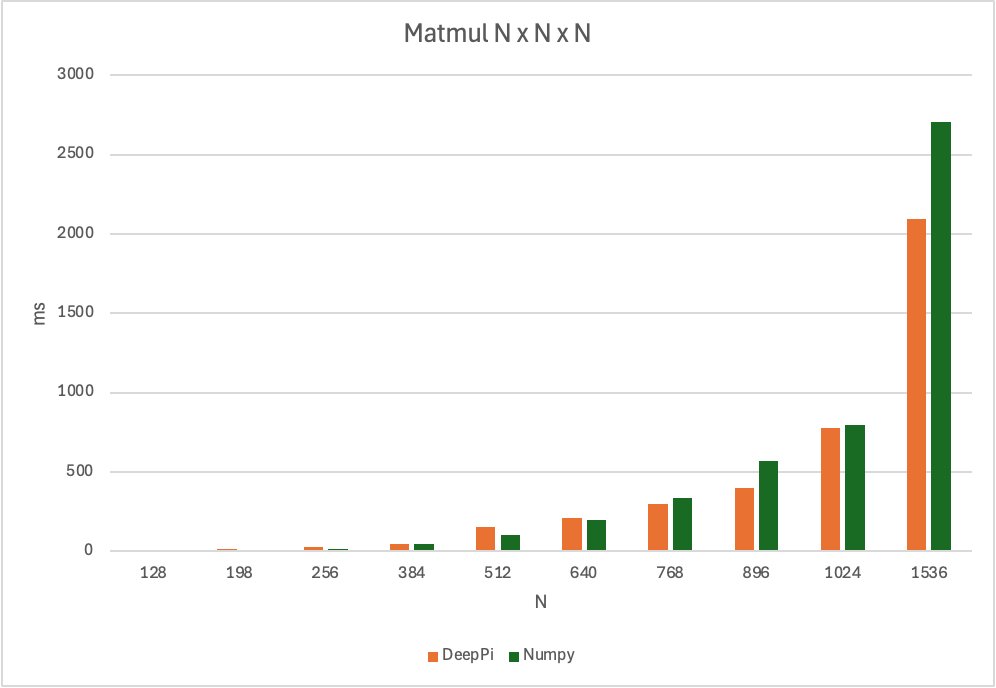

# DeepPi

C++ fundamendtal package for deep learning for scientific computing higly optimized for Raspberry Pi and other ARM devices.

## Comparison with other libraries
We are comparing DeepPi with other libraries like Eigen and Numpy on the same hardware. The benchmarks are done on a Raspberry Pi 4B with 8GB of RAM and a 64-bit OS.

Benchamrk is done for matrix sizes from 128x128 to 2048x2048. The benchmarks are done for matrix multiplication with 10 iterations and the average time is taken. The benchmarks are done for both single precision.

### Comparison with Eigen
Comparing with Eigen, DeepPi is up to 10x faster for big matrices.


## Comparison with Numpy
Comparing with Eigen, DeepPi is up 1.25x faster for big matrices, but has bigger overhead for small matrices.


## How to install gtest on Ubuntu
```bash
sudo apt-get update
sudo apt-get install libgtest-dev

cd /usr/src/googletest
sudo cmake .
sudo make
sudo cp lib/libgtest*.a /usr/lib/
```